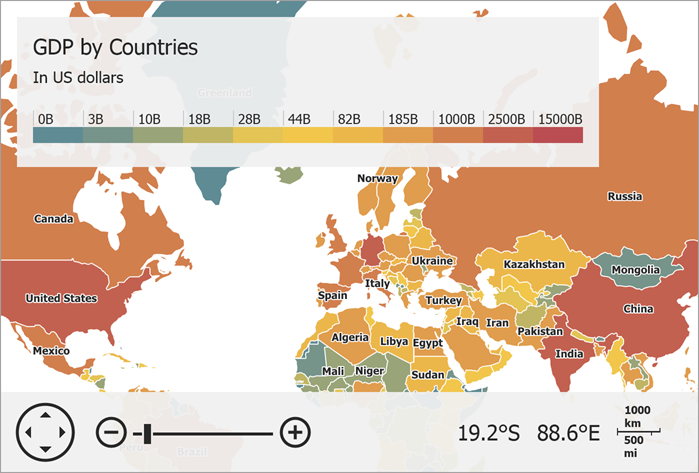

<!-- default badges list -->

<!-- default badges end -->

# Map for WinForms - Create a Choropleth Map Based on Shapes Loaded From a Shapefile

This example demonstrates how to fill map shape contours with a specific color depending on GDP data from a shapefile (_Countries.dbf_, _Countries.shp_). To load data from a shapefile, use the [ShapefileDataAdapter](https://docs.devexpress.com/WindowsForms/DevExpress.XtraMap.ShapefileDataAdapter?p=netframework).

To paint the map as in the image above, assign a [`ChoroplethColorizer`](https://docs.devexpress.com/WindowsForms/DevExpress.XtraMap.ChoroplethColorizer?p=netframework) object to the [`VectorItemsLayer.Colorizer`](https://docs.devexpress.com/WindowsForms/DevExpress.XtraMap.VectorItemsLayer.Colorizer) property.

Then, specify an attribute from a shapefile used to define the shape color. To do this, create a [`ShapeAttributeValueProvider`](https://docs.devexpress.com/WindowsForms/DevExpress.XtraMap.ShapeAttributeValueProvider) object and specify its [`AttributeName`](https://docs.devexpress.com/WindowsForms/DevExpress.XtraMap.ShapeAttributeValueProvider.AttributeName) property. Then, assign the provider to the [`ChoroplethColorizer.ValueProvider`](https://docs.devexpress.com/WindowsForms/DevExpress.XtraMap.ChoroplethColorizer.ValueProvider) property.

Split attribute values into ranges that define color boundaries. To do this, populate the [`ChoroplethColorizer.RangeStops`](https://docs.devexpress.com/WindowsForms/DevExpress.XtraMap.ChoroplethColorizer.RangeStops) collection with numeric range stops.

Populate the [`MapColorizer.ColorItems`](https://docs.devexpress.com/WindowsForms/DevExpress.XtraMap.ChoroplethColorizer.ColorItems) colors with items that define colors used to paint shapes. The colorizer automatically associates each color with the specified data range to colorize map shapes.

If you want to display information on what each color means, create a [Color Scale legend](https://docs.devexpress.com/WindowsForms/DevExpress.XtraMap.ColorScaleLegend).

## Files to Look At:

* [Form1.cs](./CS/XtraMap_ShapefileDataAdapter/Form1.cs) (VB: [Form1.vb](./VB/XtraMap_ShapefileDataAdapter/Form1.vb))

## Documentation

* [Vector Items](https://docs.devexpress.com/WindowsForms/15091/controls-and-libraries/map-control/visual-elements/vector-items)
* [Colorizers](https://docs.devexpress.com/WindowsForms/15083/controls-and-libraries/map-control/vector-data/colorizers)
* [Legends](https://docs.devexpress.com/WindowsForms/15089/controls-and-libraries/map-control/visual-elements/legends)

## More Examples

* [How to load data from a KML file](https://github.com/DevExpress-Examples/how-to-load-data-from-a-kml-file-t140303)
* [How to load SVG file content to the Map Control](https://github.com/DevExpress-Examples/how-to-load-svg-file-content-to-the-map-control-t312482)
* [How to load data from a SQL geometry data-source](https://github.com/DevExpress-Examples/how-to-load-data-from-a-sql-geometry-data-source-t175898)
* [How to configure a range distribution of ChoroplethColorizer](https://github.com/DevExpress-Examples/how-to-configure-a-range-distribution-of-choroplethcolorizer-t142434)
* [How to colorize map contours loaded from Shapefiles using the graph colorizer](https://github.com/DevExpress-Examples/how-to-colorize-map-contours-loaded-from-shapefiles-using-the-graph-colorizer-e4723)
* [How to colorize map shapes using the ShapeAttributeToColorKeyProvider class](https://github.com/DevExpress-Examples/how-to-colorize-map-shapes-using-the-shapeattributetocolorkeyprovider-class-t140151)
* [How to implement a custom colorizer](https://github.com/DevExpress-Examples/how-to-implement-a-custom-colorizer-e4753)
